# E-Commerce Store

## Introduction

Hello and welcome to my fifth milestone project, printables.  printables is a site where a user can take one of our offered products, and customize it with their own submitted image, making it their own. While the business is not real, the functionality for a user to register/login, and make valid purchases is all implemented.  

A live website can be found [here](https://printables.herokuapp.com/).

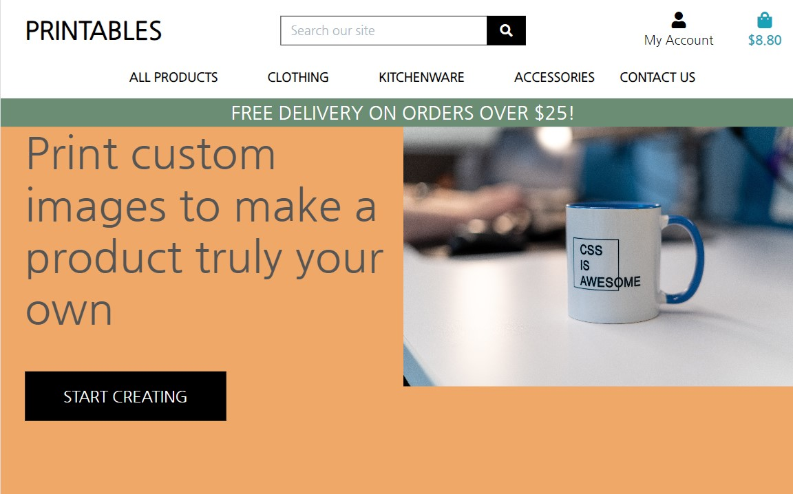

# Table of Contents

-   [1. UX](#ux)
    -   [1.1. Strategy](#strategy)
        -   [Project Goals](#project-goals)
            -   [User Goals:](#user-goals)
            -   [User Expectations:](#user-expectations)
            -   [User Stories Table](#strategy-table)
    -   [1.2. Structure](#structure)
    -   [1.3. Skeleton](#skeleton)
    -   [1.4. Surface](#surface)
-   [2. Features](#features)
-   [3. Technologies Used](#technologies-used)
-   [4. Testing](#testing)
-   [5. Deployment](#deployment)
-   [6. SEO](#seo)
-   [7. Marketing](#marketing)
-   [8. Social Media](#social-media)
-   [9. End Product](#end-product)
-   [10. Known Bugs](#known-bugs)
-   [11. Credits](#credits)

<a name="ux"></a>

# 1. UX

[Go to the top](#table-of-contents)

The inspiration for this project was actually a comic strip. I had realized in the past that I wanted products with my favorite comic, Calvin and Hobbes, on them, and I wasn't satisfied with what I could find. Nor did I find anwhwere that could print the strips as I wanted, so I decided that could be a good starting place for the project.  


<a name="strategy"></a>

## 1.1. Strategy

[Go to the top](#table-of-contents)

### Project Level Goal
 - Users can navigate the site and successfully make purchases of their desired items, accompanied by their own provided customization information

### User Expectations:
 - Users exepct the site to be responsive. 
 - Users expect the site to be functional. 
 - Users expect the site to be easy to navitage.
 - Users expect external and internal links to function correctly.
 - Users exepct the design to be aesthetically pleasing

### Agile:
 - A combination of google sheets and github projects Kanban was user to manage user stories and their statuses during the project. 

### User Stories
Opportunity/Problem/Feature| Importance (5 is very important) | Viability/Feasibility (5 is very feasible)
------------ | -------------------------|---------
View list of products | 5 | 4
View specific category of products | 3 | 3
View individual product details | 5 | 5
View constant tally of accrued total | 2 | 2
Submit custom photo to be printed on selected products | 5 | 3
Register for an account | 4 | 3
Login/logout | 4 | 3
Recover lost password | 3 |  2
Create and maintain profile | 3 |  3
Receive verification email on signup | 3 |  2
Sort products by given parameters | 4 | 3
Search site | 2 | 3
View current shopping bag | 5 | 3
Enter payment info securely | 5 | 3
Receive order confirmation and summary | 4 | 5
See customization preview in product detail | 3 | 5
See personalized customization preview using users own image | 3 | 1
Add a product as an admin | 4 | 5
Delete a product as an admin | 3 | 5
Edit a product as an admin | 3 | 5
Delete a site user as an admin | 2 | 5

<a name="structure"></a>

## 1.2. Structure

[Go to the top](#table-of-contents)

 - 

### Database Models
- Checkout Models
```
class Order(models.Model):
    order_number = models.CharField(max_length=32, null=False, editable=False)
    user_profile = models.ForeignKey(UserProfile, on_delete=models.SET_NULL,
                                     null=True, blank=True,
                                     related_name='orders')
    full_name = models.CharField(max_length=50, null=False, blank=False)
    email = models.EmailField(max_length=254, null=False, blank=False)
    image = models.TextField(max_length=254, null=False, blank=False,
                             default='')
    phone_number = models.CharField(max_length=20, null=False, blank=False)
    country = CountryField(blank_label='Country *', null=False, blank=False)
    postcode = models.CharField(max_length=20, null=True, blank=True)
    town_or_city = models.CharField(max_length=40, null=False, blank=False)
    street_address1 = models.CharField(max_length=80, null=False, blank=False)
    street_address2 = models.CharField(max_length=80, null=True, blank=True)
    county = models.CharField(max_length=80, null=True, blank=True)
    date = models.DateTimeField(auto_now_add=True)
    delivery_cost = models.DecimalField(max_digits=6, decimal_places=2,
                                        null=False, default=0)
    order_total = models.DecimalField(max_digits=10, decimal_places=2,
                                      null=False, default=0)
    grand_total = models.DecimalField(max_digits=10, decimal_places=2,
                                      null=False, default=0)
    original_bag = models.TextField(null=False, blank=False, default='')
    stripe_pid = models.CharField(max_length=254, null=False, blank=False,
                                  default='')

    def _generate_order_number(self):
        """
        Generate a random, unique order number using UUID
        """
        return uuid.uuid4().hex.upper()

    def update_total(self):
        """
        Update grand total each time a line item is added,
        accounting for delivery costs.
        """
        self.order_total = self.lineitems.aggregate(
            Sum('lineitem_total'))['lineitem_total__sum'] or 0
        if self.order_total < settings.FREE_DELIVERY_THRESHOLD:
            sdp = settings.STANDARD_DELIVERY_PERCENTAGE
            self.delivery_cost = self.order_total * sdp / 100
        else:
            self.delivery_cost = 0
        self.grand_total = self.order_total + self.delivery_cost
        self.save()

    def save(self, *args, **kwargs):
        """
        Override the original save method to set the order number
        if it hasn't been set already.
        """
        if not self.order_number:
            self.order_number = self._generate_order_number()
        super().save(*args, **kwargs)

    def __str__(self):
        return self.order_number


class OrderLineItem(models.Model):
    order = models.ForeignKey(Order, null=False, blank=False,
                              on_delete=models.CASCADE,
                              related_name='lineitems')
    product = models.ForeignKey(Product, null=False, blank=False,
                                on_delete=models.CASCADE)
    product_size = models.CharField(max_length=2, null=True,
                                    blank=True)  # XS, S, M, L, XL
    quantity = models.IntegerField(null=False, blank=False, default=0)
    lineitem_total = models.DecimalField(max_digits=6, decimal_places=2,
                                         null=False, blank=False,
                                         editable=False)

    def save(self, *args, **kwargs):
        """
        Override the original save method to set the lineitem total
        and update the order total.
        """
        self.lineitem_total = self.product.price * self.quantity
        super().save(*args, **kwargs)

    def __str__(self):
        return f'SKU {self.product.sku} on order {self.order.order_number}'
```
- Blog Model
```
class Post(models.Model):
    """
        Post Model for Blog
    """

    author = models.ForeignKey(User, on_delete=models.CASCADE, related_name="blog_posts")
    description = models.CharField(max_length=300, unique=True)
    body = models.TextField()
    created_on = models.DateTimeField(auto_now_add=True)
    title = models.CharField(max_length=300, unique=True)
    slug = models.SlugField(max_length=300, unique=True)
    status = models.IntegerField(choices=STATUS, default=1)

    class Meta:
        """
            Metadata for Post Model
        """
        ordering = ['-created_on']

    def __str__(self):
        return self.title
```
 - Contact Models
```class Contact(models.Model):
    '''Contact model'''
    name = models.CharField(blank=False, null=False, max_length=99)
    email = models.EmailField(blank=False, null=False, max_length=199)
    date = models.DateTimeField(auto_now_add=True)
    topic = models.CharField(max_length=50, null=False, blank=False,
                             default='')
    content = models.TextField(blank=False, null=False, max_length=500)


class Newsletter(models.Model):
    '''Newsletter contact model'''
    first_name = models.CharField(blank=False, null=False, max_length=99)
    email = models.EmailField(blank=False, null=False, max_length=500)
    date = models.DateTimeField(auto_now_add=True)

    def __str__(self):
        return self.email
```
 - Products Models
 
 ```
 class Category(models.Model):

    class Meta:
        verbose_name_plural = 'Categories'

    name = models.CharField(max_length=254)
    friendly_name = models.CharField(max_length=254, null=True, blank=True)

    def __str__(self):
        return self.name

    def get_friendly_name(self):
        return self.friendly_name


class Product(models.Model):
    category = models.ForeignKey('Category', null=True, blank=True,
                                 on_delete=models.SET_NULL)
    sku = models.CharField(max_length=254, null=True, blank=True)
    name = models.CharField(max_length=254)
    description = models.TextField()
    has_sizes = models.BooleanField(default=False, null=True, blank=True)
    price = models.DecimalField(max_digits=6, decimal_places=2)
    rating = models.DecimalField(max_digits=6, decimal_places=2, null=True,
                                 blank=True)
    image_url = models.URLField(max_length=1024, null=True, blank=True)
    image = models.ImageField(null=True, blank=True)
    image_preview = models.ImageField(null=True, blank=True)

    def __str__(self):
        return self.name
```

- Profiles Models
```
class UserProfile(models.Model):
    """
    A user profile model for maintaining default
    delivery information and order history
    """
    user = models.OneToOneField(User, on_delete=models.CASCADE)
    default_phone_number = models.CharField(max_length=20,
                                            null=True, blank=True)
    default_street_address1 = models.CharField(max_length=80,
                                               null=True, blank=True)
    default_street_address2 = models.CharField(max_length=80,
                                               null=True, blank=True)
    default_town_or_city = models.CharField(max_length=40,
                                            null=True, blank=True)
    default_county = models.CharField(max_length=80,
                                      null=True, blank=True)
    default_postcode = models.CharField(max_length=20,
                                        null=True, blank=True)
    default_country = CountryField(blank_label='Country',
                                   null=True, blank=True)

    def __str__(self):
        return self.user.username


@receiver(post_save, sender=User)
def create_or_update_user_profile(sender, instance, created, **kwargs):
    """
    Create or update the user profile
    """
    if created:
        UserProfile.objects.create(user=instance)
    # Existing users: just save the profile
    instance.userprofile.save()
```

<a name="skeleton"></a>

## 1.3. Skeleton

[Go to the top](#table-of-contents)

### Wire-frames

- Home Page Wireframe

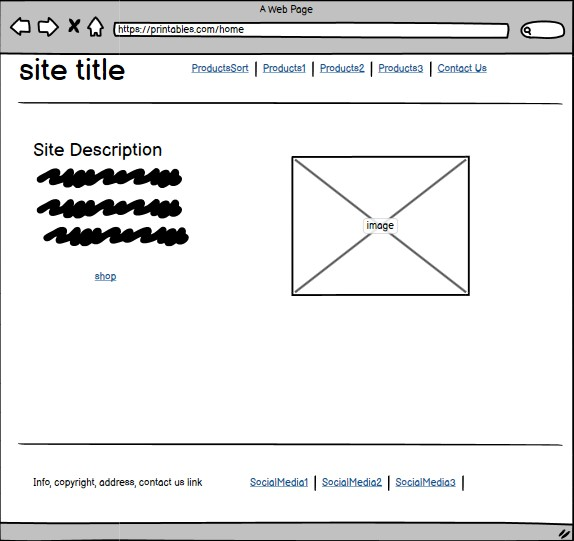

- Auth Wireframe

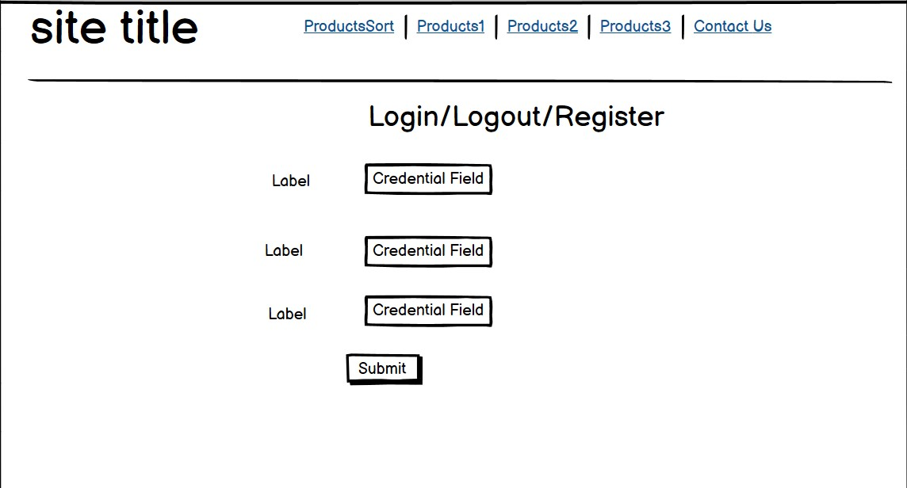

- Bag Page Wireframe

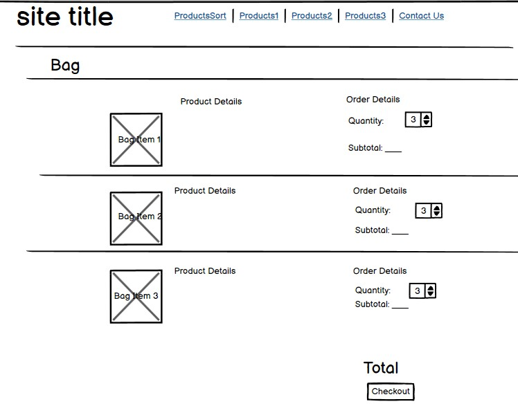

- Checkout Page Wireframe

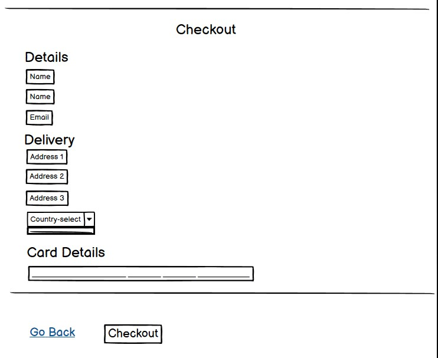

- Contact Page Wireframe


- Product Detail Page Wireframe

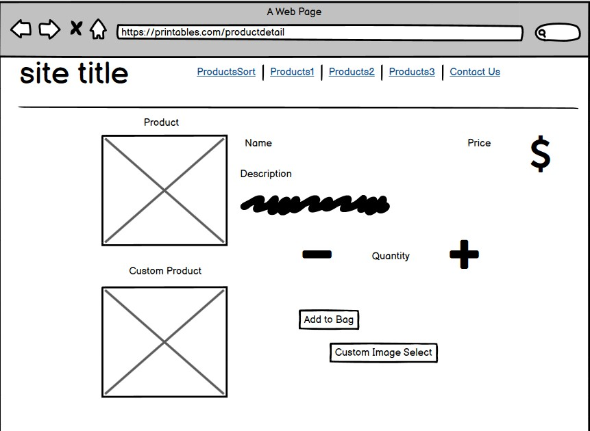

- Verification Page Wireframe


- Products Page Wireframe

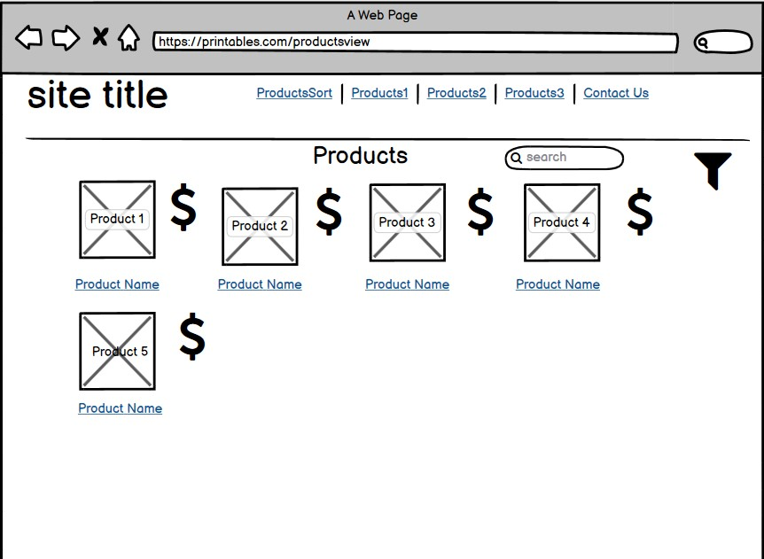


<a name="surface"></a>

## 1.4. Surface

[Go to the top](#table-of-contents)


### Typography
- The font Nanum Gothic was used for this project, as I thought it's style well reflected the site's creative theme.

<a name="features"></a>

# 2. Features

[Go to the top](#table-of-contents)

### All Pages

- Printables link in the top left navigating to home
- Navbar header allowing for quick sorting of products by parameters and category, and linking to contact page
- Footer with social media links and site info
- Back to top functionality after scrolling
- If logged in, navbar has option to logout
- If logged out, navbar has option to login
- Current bag total listed in top right, on clickable bag link


### Sign Up Page
- Functional sign up form
- Link to login if already signed up

### Login Page
- Functional login form
- Link to signup form if not registered

### Logout Page
- Functional logout form
- Confirmation message with backout option

### Landing Page
- Background image of a customized product
- Welcome message
- Large call to action button to go shop

### Products Page
- Admin CRUD functionality on products
- Sort functionality, by category, parameter, or both simultaneously
- List of products in a row, side by side, with scroll if there are enough to force the page to expand
- Product details summarized near product

### Products Detail Page
- Large image of product and image of where custom design would go on product
- Product details and description
- Product quantity selector, can't go below 1
- Admin CRUD functionality on product in question

### Bag Page
- Back to shopping button
- Display of all items in bag as line items, with ability to change quantity on the spot
- Product speficic subtotals are displayed
- Grand total is displayed at the bottom
- Proceed to checkout button

### Checkout Page
- Functional checkout form
- User save info option, for later sessions
- Back to bag button
- Order summary 
- Functional and secure stripe card field

### Checkout Success Page
- Order summary presented in convenient box, all in one place for user to evaluate
- Back to shopping button

### User Profile Page
- Delivery information, able to be edited and deleted
- Order history

### Newsletter Subscribe Page
- Functional newsletter form

### Contact Form Page
- Functional contact form page

<a name="technologies-used"></a>

## 3. Technologies Used

[Go to the top](#table-of-contents)

-   [HTML5](https://en.wikipedia.org/wiki/HTML)
    -   The project uses HyperText Markup Language.
-   [CSS3](https://en.wikipedia.org/wiki/CSS)
    -   The project uses Cascading Style Sheets.
-   [JavaScript](https://en.wikipedia.org/wiki/JavaScript)
    -   The project uses JavaScript.
-   [Python](https://en.wikipedia.org/wiki/Python_(programming_language))
    -   The project uses Python.
-   [Django](https://www.djangoproject.com/)
    -   The project uses Django as the main framework.
-   [Boostrap 4](https://getbootstrap.com/docs/4.0/getting-started/introduction/)
    -   The project uses Bootstrap 4.
-   [PostgreSQL](https://www.postgresql.org/)
    -   The project uses PostgreSQL as a database.
-   [AWS](https://aws.amazon.com/)
    -   The project uses Amazon Web Services to host all static and media files.
-   [Gitpod](https://www.gitpod.io/)
    -   The project uses Gitpod.
-   [Chrome](https://www.google.com/intl/en_uk/chrome/)
    -   The project uses Chrome to debug and test the source code using HTML5.
-   [Heroku](https://www.heroku.com/)
    -   The project is deployed and hosted by Heroku.
-   [Balsamiq](https://balsamiq.com/)
    -   Balsamiq was used to create the wireframes during the design process.
-   [Google Fonts](https://fonts.google.com/)
    -   Google fonts were used to import the "Nanum Gothic" font.
-   [GitHub](https://github.com/)
    -   GitHub was used to store the project's code after being pushed from Git.
-   [Stripe](https://stripe.com/)
    -   Stripe was used to faciliate the payment system.


<a name="testing"></a>

# 4. Testing

[Go to the top](#table-of-contents)
### Responsive Tools
Chrome dev tools were used to assess responsivity, testing the products over a variety of standard device sizes and adding media queries when necessary.

### W3C Validator Tools

#### HTML:
- w3c has some issues with django, displaying an error like this one at almost every occasion.
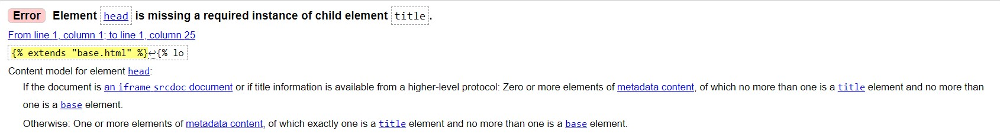
- Other than this, the following html error was pointed out and fixed
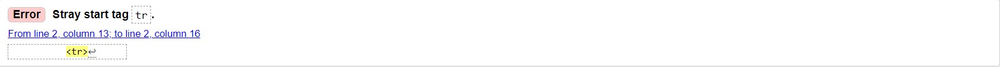
No further issues were detected


#### CSS:
w3c was used to validate all css. No errors were detected.
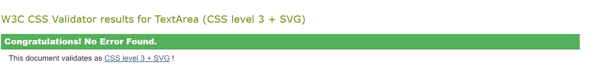

### JavaScript:
- jshint was used to validate all js code. Some warnings were brought up about system version, but they remained only warnings
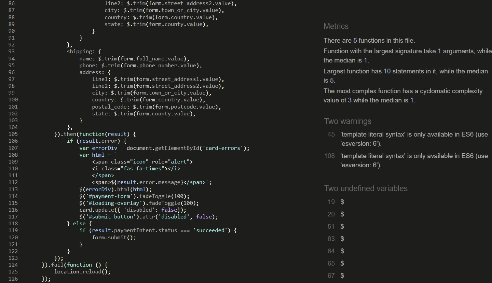

### Python:
I used python3 -m flake8 to test code in gitpod, and evaluated problems as they displayed in the terminal for each file.  This allowed me to rememdy some errors (mostly deleting imports that generate automatically) and add several new lines at the bottom of file when demanded, but some linetoolong errors were kept as those files were finnicky to format, such as in settings.py 


## Manual Testing

- The deployed version of the site was tested as follows

### Navigation Bar

All Pages:
TEST            | OUTCOME                          | PASS / FAIL  
--------------- | -------------------------------- | ---------------
Home link | When clicking on the logo in the top left, or on back to home links, the browser redirects me to the home page. | Pass
Navbar | When clicking through the different nav bar elements, they take me to their respective correct destinations, sorting by category accordingly if necessary. | Pass
Footer | When clicking the social media links, they open to the correct destinations in a new tab | Pass
Bag | When clicking the bag icon in the top right, I am taken to the shopping bag page | Pass
Profile | When clicking the My Account link, I am taken from the dropdown menu to either the profile page or logout page accurately | Pass
Search | Search bar displays and searches when enter is pressed or the search icon is clicked, and displays results relevant to the search | Pass
Styling | Styling loads correctly | Pass

### Home page
TEST            | OUTCOME                          | PASS / FAIL  
--------------- | -------------------------------- | ---------------
Media Queries | Media queries are functioning accurately for the background image | Pass

### Products page
TEST            | OUTCOME                          | PASS / FAIL  
--------------- | -------------------------------- | ---------------
Products | Products load and display correctly sorted based on sorting parameters | Pass
Style | Styling loads correctly | Pass
Links | Clicking on either the image or the product name takes you to the product detail page | Pass
CRUD | Admins have CRUD functionality on products page | Pass
Sorting | Sorting bar works as intended, sorting by chosen parameter | Pass

### Products details page
TEST            | OUTCOME                          | PASS / FAIL  
--------------- | -------------------------------- | ---------------
Style | Styling loads correctly | Pass
Quantity | Quantity selector accurately ticks quantity either upward or downward with a minimum of 1 | Pass
Back | Back to shopping link sends me back to products | Pass
Bag | Add to bag button takes me to my bag | Pass
Images | Product image and image preview load | Pass

### Shopping bag page
TEST            | OUTCOME                          | PASS / FAIL  
--------------- | -------------------------------- | ---------------
Quantity | Quantity selector and removal option accurately removes or adds item to bag | Pass
Style | Styling loads correctly | Pass
Back | Keep shopping button redirects users to products | Pass
Checkout | Checkout button redirects users to checkout | Pass
Total | Grand total and subtotals tally accurately | Pass

### Checkout page
TEST            | OUTCOME                          | PASS / FAIL  
--------------- | -------------------------------- | ---------------
Style | Styling loads correctly | Pass
Form | Checkout form in its entirety loads correctly | Pass
Address | Address format from django loads properly, with the accompanying countryfield selector in the dropdown | Pass
Payment | Card details can be provided and payment functions, facilitated by stripe | Pass
Back | Adjust bag button takes me to bag | Pass
Complete order | Button completes order | Pass
Save | Save delivery checkbox saves info of user | Pass

### Checkout success page
TEST            | OUTCOME                          | PASS / FAIL  
--------------- | -------------------------------- | ---------------
Order details | Order details display properly | Pass 
Style | Styling loads correctly | Pass
Order history | Order is added to order history | Pass

### My profile pags
TEST            | OUTCOME                          | PASS / FAIL  
--------------- | -------------------------------- | ---------------
Update | Delivery info can be edited and updates accordingly | Pass 
Style | Styling loads correctly | Pass
Order history | Order history loads correctly | Pass

### Contact US
TEST            | OUTCOME                          | PASS / FAIL  
--------------- | -------------------------------- | ---------------
Style | Styling loads correctly | Pass
Contact form | Contact form loads correctly | Pass
Newsletter form | Newsletter form loads correctly | Pass
Redirects | Forms redirect to home upon completion, with success message | Pass

### Blog
TEST            | OUTCOME                          | PASS / FAIL  
--------------- | -------------------------------- | ---------------
Style | Styling of all blog templates loads correctly | Pass
Add post form | Page and post form load correctly, and only admins can create posts | Pass
Blog view | Blog posts load and can be viewed by the user | Pass
Post Detail | Individual posts can be viewed speficially.  | Pass
Links | Navigation throughout posts and back to blog fucntion correctly. |  Pass


### Authorization
TEST            | OUTCOME                          | PASS / FAIL  
--------------- | -------------------------------- | ---------------
Login | Login function works for verified users and sends message | Pass
Logout | Logout function works and sends message | Pass
Register | Unregistered users can signup and receive an email for confirmation on signup | Pass
Admin | Admin panel loads at appropriate URL, and admin functionality follows if the user is a superuser | Pass


<a name="deployment"></a>

# 5. Deployment
[Go to the top](#table-of-contents)

The final version of the project was deployed to heroku.  A step by step walkthrough to deployment is provided below.  

1. Create a heroku account, if one is not owned already.  Create a new app on Heroku, and in my case, buy the minimum, 5$ a month plan to support the dyno. 
2. The requisite installments for the project must now be installed within the interface application, which is gitpod in my case. This entails running pip3 install -r "requirements.txt" with every required installation added into the requirements.txt file.  Specifically, dj_database_url and psycopg2 are necessary to connect to your external datbase here. 
3. In settings.py import dj_database_url. Then comment out the default database, and add the unique database url for your project, in my case an elephantSQL URL. Run migrations to apply this new URL.  
4. Create a SuperUser for this Postgres database.  In Elephant sql, you will need to execute the auth_user option in table queries to confirm your database. 
5. Create Procfile so that Heroku creates a web dyno so that it will run gunicorn and serve the Django app. The requisite line will look like this "web: gunicorn printables.wsgi:application", with your unique app name before the .wsgi.
6. Disable Heroku collect static in config vars in the settings of your heroku app.  Also add a new unique secret key to the variables here. 
7. Add the Heroku hostname to allowed hosts in settings.py
8. Move secret key in settings.py to a ceated env.py file
9. Set debug to True only if the environment is a development environment
10. Run the python3 manage.py loaddata command for all fixtures in order to import your projects data into your databases. If one fixture relies on another, in my case products has a "category" which is a separate fixture, make sure to load the base fixture first, so the one reliant on it has something to reference. 
11. Commit and push to GitHub and Heroku 
12. Create an AWS account and a new S3 bucket. You will need to select the closest region to you and follow other basic steps to complete the bucket. You will also need to turn on static website hosting in the properties tab to allow the hosting of your site. 
13. Go to the bucket policy tab, creating a new s3 bucket policy. You will want to create a new policy, allowing all principals by selecting the star option. You will need the Amazon Resource Name from the prior AWS account tab to copy into the ARN box.  Then generate the policy.
14. In the S3 navitagion, navigate to the access control list tab and allow public access. 
15. Create a user and group to use your bucket using Amazon IAM, Identity and Access management. In the services menu of AWS select IAM. 
16. In IAM, first create a group and name it. Then go to the JSON tab and import the prebuilt s3 full access policy. Paste the ARN from the bucket prior into the policy to allow it access only to the bucket instead of everything. 
17. In IAM, select the created group, and attach the newly created policy. Then navigate to the users page and create a new user, giving them programmatic access and putting them in your created group. Now download the user CSV file which contains your user access key and secret key which will need to be in config vars in heroku. Once dowloaded, add each of these separately into config vars.  
18. Now attach django to this bucket. You will need to install boto3 and django-storages and add them to requirements.txt to do this. 
19. Add an if statment in settings.py checking for USE_AWS in the environment. This will trigger for heroku but not locally. If the check passes,  define the AWS bucket name, region name, and set the access key and secret key to be obtained from the environment. Those are the keys already added to heroku config vars. Also add now in heroku config vars a USE_AWS variable set to true.  
20. In settings.py, define the custom domain name which will be an f string of the bucket name, followed by .s3.amazonaws.com.
21. Create a new file called custom storages, and import settings from django.conf and the s3boto3 storage class from django.storages. Create StaticStorage and MediaStorage classes.
22. Then return to settings.py and add a statement specifying the location to store static and media files. 
23. Override the STATIC_URL and MEDIA_URL URLS with your custom domain URLS in settings.py. This step and the two prior can be viewedtheir respective sections in the settings.py file, to use as guidance for formatting.
24. Commit and push to GitHub and Heroku
25. In the S3 bucket create a new folder for media. Here, upload all project media and images. 
26. in Stripe, you'll have created a webhook endpoint. This will also have given you usable secret keys and access keys for your project.  Add these keys with their respective names to Heroku config variables. These will be the environment variables referenced in the stripe section of settings.py. 


<a name="seo"></a>

# 6. SEO
[Go to the top](#table-of-contents)

To improve the search engine optimisation (SEO) of the site I:

- Created a bank of keywords specifically relating to customization and personalization. This was the niched I'd identified as best to target for the company, as it avoided being overly general why generating enough volume, and with limited competition.  These keywords are listed below

    - "custom printed, custom t-shirt, custom sweatshirt, custom plate, custom mug, print-on-demand, custom image, custom clothing, custom phone case, custom wallet, custom kitchenware, custom design, design-your-own, user-created clothing, user-created-kitchenware, user-created phone case, user-created wallet, personalized gift ideas, personanlized clothing, personalized kitchenware, personalized phone case, personalized wallet, best personalized gifts, best personalized gift ideas, best custom gifts, best custom gift ideas"


- I also was selective about using these keywords in the site. In keeping with good SEO habits, I included these keywords strategically in h, em, and strong elements throughout the html documents, making them better suited for the keyword algorithms. For example, the entry message in a giant h3 tab in index.html contains such keywords.

- It is also worth noting that in the social media links at the bottom, rel=noopener was included to make it clear the evaluation algorithms should ignore those links when evaluating my site's quality. 

<a name="marketing"></a>

# 7. Marketing
[Go to the top](#table-of-contents)

- In my view, the best types of marketing for a site like this are the following:
    - SEO
    - Content Marketing via Social Media
    - Affiliate marketing

- Content marketing specifically through social media is a strong approach for increasing exposure to the customization capacity. Not only will they form rapports with customers, but they can get free exposure through the posting of successfully printed products, etc. This is a good place for targeted advertising as well, pointing their site towards customers who are already interested in customization, etc. 

- Affiliate marketing--printables should form partenerships with entities who could help increase their exposure and volume, like etsy, for example--selling their own items through etsy's interface.

<a name="social-media"></a>

# 8. Social Media Business Page
[Go to the top](#table-of-contents)

This is an example of what the facebook page might look like. 

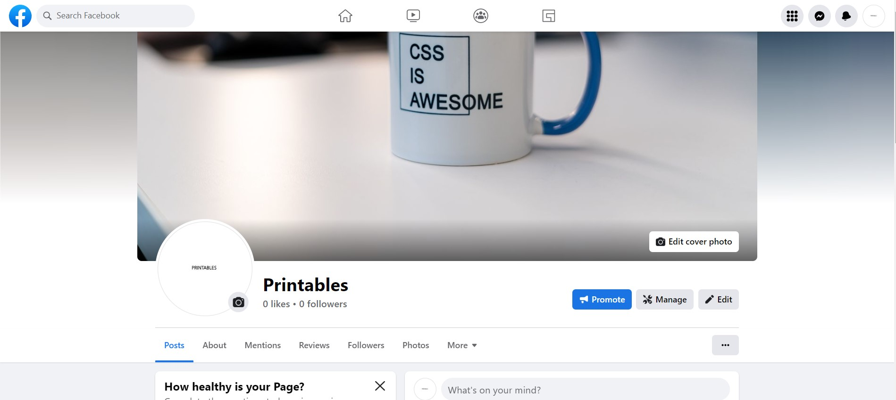

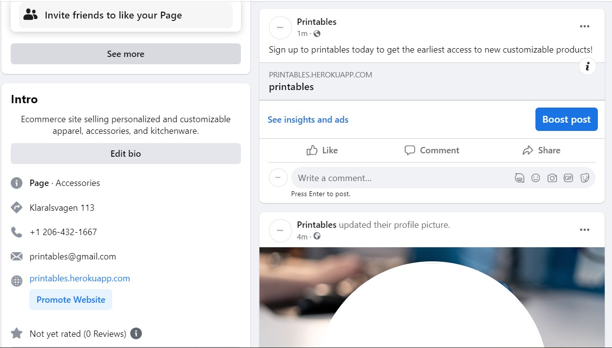


<a name="end-product"></a>

# 9. End Product
[Go to the top](#table-of-contents)

- Home page


- Products page

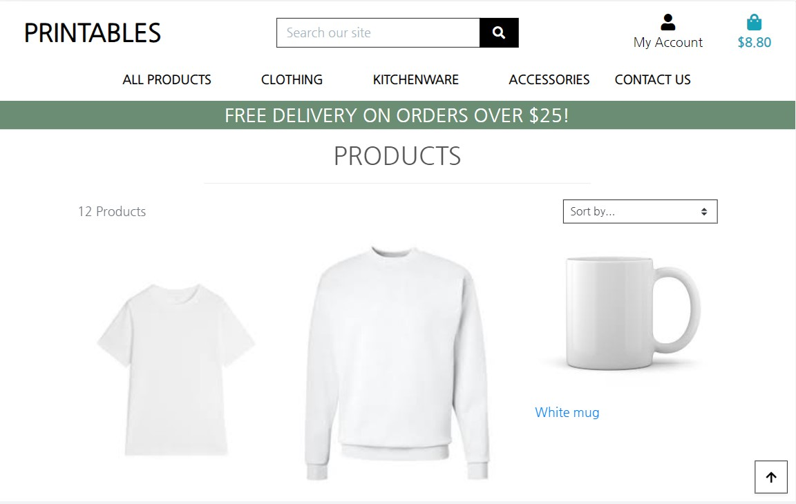

- Product detail page

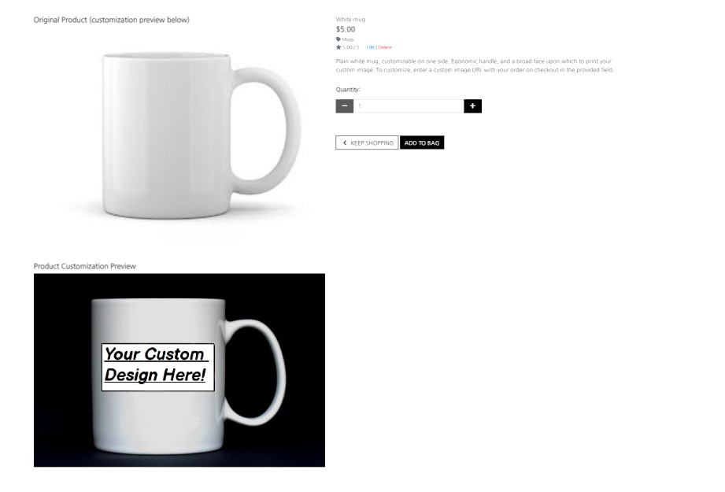

- Bag page

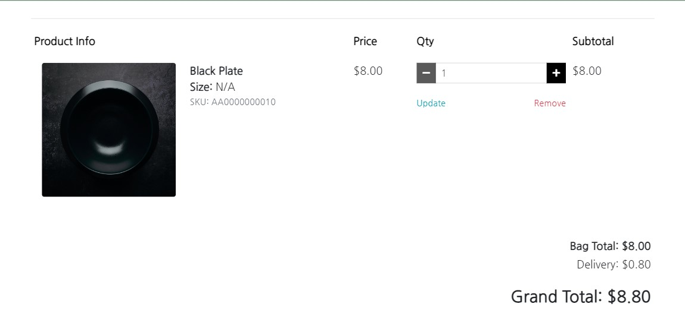

- Checkout page

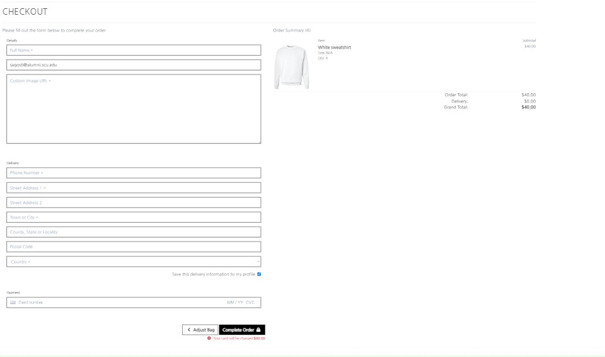

- Contact page

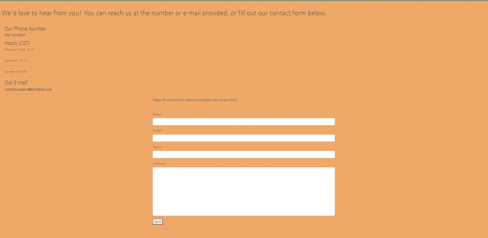

- Newsletter page

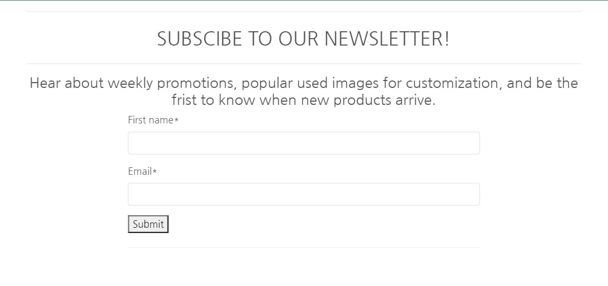

- Profile page

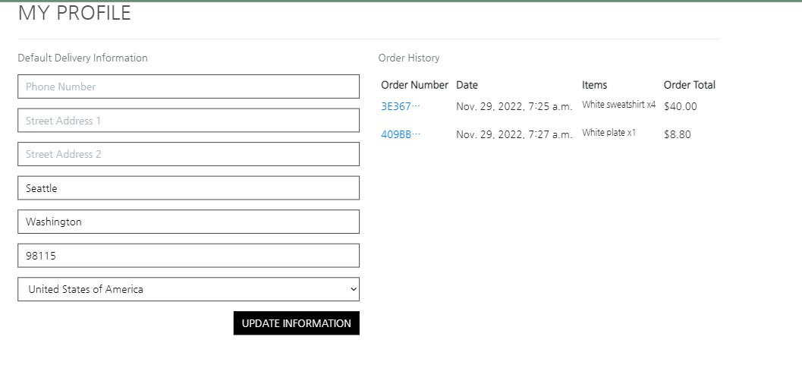

- Checkout Success page


<a name="known-bugs"></a>

# 10. Known Bugs
[Go to the top](#table-of-contents)
- Slight indent on contact us page in mobile view
- Custom 404 isn't rendered on a bad URL--citing that debug is still true, even though env.py is in the gitignore and neither debug nor development are true in config vars in heroku

<a name="credits"></a>

# 11. Credits

[Go to the top](#table-of-contents)

### Code

 - Much of the general strucutre and skeleton of the site is taken, as advised by my mentor, from the boutiqe ado project, as doing so offers much initial ecommerce functionality. 


### Content

- All images on the site came from either unsplash, pixabay, or adobe stock.

- The readme skeleton was the same as I used from prior projects, so it comes premade with functional links and navigation, originate from user ikelvvv.

As always, thanks to tutor support for being patient and helpful, and to my mentor Marcel for his pinpoint advice.
